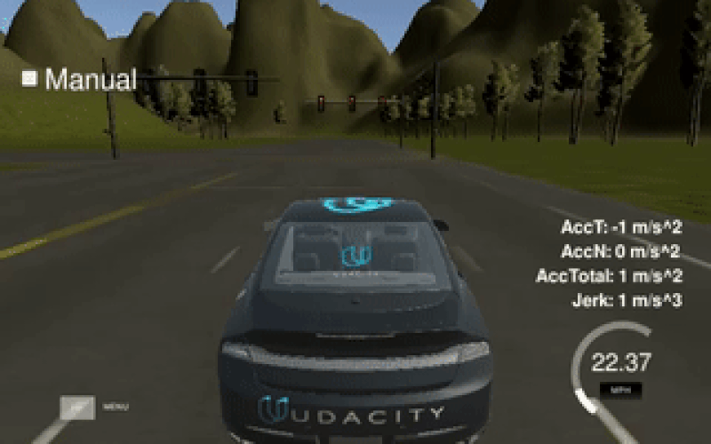

Final project of the Udacity Self-Driving Car Nanodegree: Programming a Real Self-Driving Car. For more information about the project, see the project introduction [here](https://classroom.udacity.com/nanodegrees/nd013/parts/6047fe34-d93c-4f50-8336-b70ef10cb4b2/modules/e1a23b06-329a-4684-a717-ad476f0d8dff/lessons/462c933d-9f24-42d3-8bdc-a08a5fc866e4/concepts/5ab4b122-83e6-436d-850f-9f4d26627fd9).



# Submission
## Sanket Gujar (srgujar (at) wpi.edu)


# Introduction
Carla use waypoint navigation to drive autonomously while avoiding obstacles and stopping at traffic lights. Waypoints are ordered set of coordinated that Carla uses to plan a path. Each waypoint has a associated target velocity which depends on the desired vehicle behavior. There are 3 modules implementation for this project:
1. Perception:

   a. Traffic light detection

   b. Obstacle detection

2. Planning:

   Waypoint Updater (Set the velocity for each waypoint)

3. Contol:

   Controls the car's throttle, steering, and brake using Dataspeed Drive by wire (DBW) ROS node.


# Architecture


# Perception


|Topic | Info |
|--- | --- |
|/traffic_waypoint | index of the waypoint for nearest upcoming red light's stop line|
|/current_pose| Provides the current position|
|/base_waypoints| list of waypoints the car will be following|
|/image_color |image stream from the car's camera|
|/vehicle/traffic_lights | (x, y, z) coordinates of all traffic light|


# Planning

The purpose of this node is to update the target velocity property of each waypoint based on traffic light and obstacle detection. It will publish a list of waypoints ahead of the car with target velocities to the /final_waypoints topic.


|Topic | Info |Type|
|--- | --- |--|
|/final_waypoint |list of waypoints ahead of the car with target velocities |styx_msgs/Lane|
|/obstacle_waypoint |  location to stop for obstacle|
|/traffic_waypoint | location to stop for red light|
|/current_pose| Provides the current position| geometry_msgs/PoseStamped|
|/base_waypoints| list of waypoints the car will be following provided by a static .csv file|	styx_msgs/Lane |

The /base_waypoints topic publishes a list of all waypoints for the track, so this list includes waypoints both before and after the vehicle.

/basewaypoints contain a header and a Waypoint list named waypoints. Each waypoint has pose and twist data. twist.twist data contains 3D linear and angular velocities.

I used KDTree to find the waypoints that are closest to the car.

# Controls

Carla is equipped with a drive-by-wire (dbw) system, meaning the throttle, brake, and steering have electronic control. This package contains the files that are responsible for control of the vehicle: the node dbw_node.py and the file twist_controller.py, along with a pid and lowpass filter. The dbw_node subscribes to the /current_velocity topic along with the /twist_cmd topic to receive target linear and angular velocities. Additionally, this node will subscribe to /vehicle/dbw_enabled, which indicates if the car is under dbw or driver control. This node will publish throttle, brake, and steering commands to the /vehicle/throttle_cmd, /vehicle/brake_cmd, and /vehicle/steering_cmd topics.


Throttle values passed to publish are in the range 0 to 1, a throttle of 1 means the vehicle throttle will be fully engaged. Brake values passed to publish is in units of torque (N*m). The correct values for brake is computed using the desired acceleration, weight of the vehicle, and wheel radius.
```
brake  = deceleration x vehicle mass x wheel radius
```


|Topic | Info |
|--- | --- |
|/current_velocity and /twist_cmd| target linear and angular velocity|
|/vehicle/dbw_enabled| car control under dbw or manual|


## Installation
Please use **one** of the two installation options, either native **or** docker installation.

### Native Installation

* Be sure that your workstation is running Ubuntu 16.04 Xenial Xerus or Ubuntu 14.04 Trusty Tahir. [Ubuntu downloads can be found here](https://www.ubuntu.com/download/desktop).
* If using a Virtual Machine to install Ubuntu, use the following configuration as minimum:
  * 2 CPU
  * 2 GB system memory
  * 25 GB of free hard drive space

  The Udacity provided virtual machine has ROS and Dataspeed DBW already installed, so you can skip the next two steps if you are using this.

* Follow these instructions to install ROS
  * [ROS Kinetic](http://wiki.ros.org/kinetic/Installation/Ubuntu) if you have Ubuntu 16.04.
  * [ROS Indigo](http://wiki.ros.org/indigo/Installation/Ubuntu) if you have Ubuntu 14.04.
* [Dataspeed DBW](https://bitbucket.org/DataspeedInc/dbw_mkz_ros)
  * Use this option to install the SDK on a workstation that already has ROS installed: [One Line SDK Install (binary)](https://bitbucket.org/DataspeedInc/dbw_mkz_ros/src/81e63fcc335d7b64139d7482017d6a97b405e250/ROS_SETUP.md?fileviewer=file-view-default)
* Download the [Udacity Simulator](https://github.com/udacity/CarND-Capstone/releases).

### Docker Installation
[Install Docker](https://docs.docker.com/engine/installation/)

Build the docker container
```bash
docker build . -t capstone
```

Run the docker file
```bash
docker run -p 4567:4567 -v $PWD:/capstone -v /tmp/log:/root/.ros/ --rm -it capstone
```

### Port Forwarding
To set up port forwarding, please refer to the [instructions from term 2](https://classroom.udacity.com/nanodegrees/nd013/parts/40f38239-66b6-46ec-ae68-03afd8a601c8/modules/0949fca6-b379-42af-a919-ee50aa304e6a/lessons/f758c44c-5e40-4e01-93b5-1a82aa4e044f/concepts/16cf4a78-4fc7-49e1-8621-3450ca938b77)

### Usage

1. Clone the project repository
```bash
git clone https://github.com/udacity/CarND-Capstone.git
```

2. Install python dependencies
```bash
cd CarND-Capstone
pip install -r requirements.txt
```
3. Make and run styx
```bash
cd ros
catkin_make
source devel/setup.sh
roslaunch launch/styx.launch
```
4. Run the simulator

### Real world testing
1. Download [training bag](https://s3-us-west-1.amazonaws.com/udacity-selfdrivingcar/traffic_light_bag_file.zip) that was recorded on the Udacity self-driving car.
2. Unzip the file
```bash
unzip traffic_light_bag_file.zip
```
3. Play the bag file
```bash
rosbag play -l traffic_light_bag_file/traffic_light_training.bag
```
4. Launch your project in site mode
```bash
cd CarND-Capstone/ros
roslaunch launch/site.launch
```
5. Confirm that traffic light detection works on real life images


run the following commands if you get dbw error messages
```
sudo apt-get update
sudo apt-get install -y ros-kinetic-dbw-mkz-msgs
cd /home/workspace/CarND-Capstone/ros
rosdep install --from-paths src --ignore-src --rosdistro=kinetic -y
```

### Attributions

-[https://becominghuman.ai/traffic-light-detection-tensorflow-api-c75fdbadac62](https://becominghuman.ai/traffic-light-detection-tensorflow-api-c75fdbadac62)

-[https://github.com/mkoehnke/CarND-Capstone-TrafficLightDetection](Mathias Detection)
